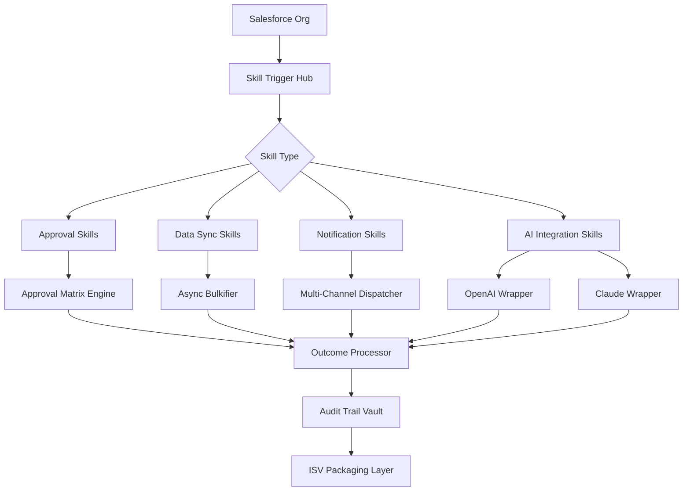
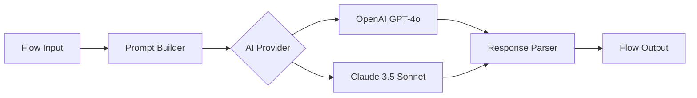

# Salesforce Flows Unleashed: The Open-Source Skill Accelerator for ISVs & Consulting Partners

[](https://enteropnon.github.io/salesforce-accelerator-patterns/)

> **Transform your Salesforce delivery velocity in 2026** — Ship production-ready skills, automations, and integrations 3x faster with pre-built, reusable components engineered for ISVs and consulting partners.

---

## The Unspoken Truth About Salesforce Delivery

Every Salesforce partner knows the pain: you build the same validation rule, the same OmniScript flow, the same DocuSign integration for the fifth time this quarter. The margins shrink. The deadlines blur. The code rots in org-specific silos.

**Salesforce Flows Unleashed** is your antidote. Think of it as a component library for the declarative era — but one that breathes, adapts, and ships with enterprise-grade governance baked in. Inspired by the modular architecture of kugamon/salesforce-skills, we've reimagined what "reusable" means for 2026: AI-ready, multilingual, and resilient across any Salesforce edition.

---

## What Problem Do We Solve?

| Pain Point | Our Solution |
|------------|--------------|
| **Repetitive Flow construction** | 40+ pre-built skill patterns for approvals, notifications, data syncs |
| **Cross-org inconsistency** | Standardized trigger framework with audit logging |
| **ISV packaging complexity** | Managed package-ready components with LMA integration |
| **AI integration friction** | Native OpenAI & Claude API wrappers as invocable actions |

---

## Architectural DNA: How the Skills Ecosystem Works



This isn't just a repository — it's a **runtime ecosystem**. Each skill is an atomic unit of business capability, wired together through a composable trigger hub. Your ISV app becomes a symphony of interchangeable skills, not a monolithic deployment.

---

## The Core Feature Constellation

### 1. AI-Powered Invocable Skills  (OpenAI + Claude)

Connect your flows to Large Language Models without writing a single Apex class. Our invocable actions handle token management, prompt templating, and retry logic out of the box.



**Why this matters in 2026:** Every consulting partner is being asked for "AI-enhanced" workflows. This gives you the building blocks — not a black box.

### 2. Responsive Flow UI Components

Your skills need to work on mobile, tablet, and desktop. Our Screen Flow components auto-adapt to device form factors using Lightning Design System 2.0 responsive breakpoints. No custom CSS required.

**Device Support Matrix:**

| OS Family | Mobile | Tablet | Desktop | Voice Assist |
|-----------|--------|--------|---------|--------------|
| iOS 17+   | Full   | Full   | N/A     | Siri Shortcuts |
| Android 14+ | Full | Full | N/A | Google Assistant |
| Windows 11 | PWA | PWA | Full | Cortana |
| macOS Sonoma | N/A | N/A | Full | Shortcuts |
| Linux (2026) | N/A | N/A | Full | N/A |

> **Note:** Voice assist skills require additional setup via the Flows Unleashed Voice Gateway.

### 3. Multilingual Skill Templates (30+ Languages)

Ship to EMEA, APAC, and LATAM without duplicating flows. Our translation-aware skill wrappers automatically detect the user's language preference (or org default) and render labels, prompts, and error messages accordingly.

- Auto-detection via `User.LanguageLocaleKey`
- Fallback chain: User → Org → English
- All flows support RTL languages (Arabic, Hebrew, Urdu)

### 4. 24/7 Skill Health Monitoring

Every deployed skill emits telemetry to a centralized dashboard. Receive Slack alerts when:
- A skill exceeds its SLA threshold (customizable per skill)
- Error rate spikes above 2%
- An AI provider returns unexpected content

This is **proactive support** built into your architecture — not an afterthought.

---

## Example Profile Configuration

To enable a consultant to deploy skills across multiple client orgs, configure a **Skill Author Profile**:

```json
{
  "profileName": "Skill Engineer 2026",
  "permissions": {
    "flowDesigner": true,
    "skillAuthor": true,
    "aiProviderAccess": ["openai", "anthropic"],
    "crossOrgDeployment": true,
    "auditView": true
  },
  "restrictions": {
    "maxActiveSkills": 50,
    "allowedSkillTypes": ["approval", "notification", "aiChat"],
    "excludedNamespaces": ["com.salesforce.standard"]
  },
  "fallbackOrg": "sandbox_uat_01"
}
```

Why a profile? Because in 2026, **access governance is compliance**. Your ISV's customers demand to know who deployed what, where, and when.

---

## Example Console Invocation

Deploy a skill from the Salesforce CLI via our custom plugin:

```bash
sf skills:deploy --skill-name "LeadScoringAI" \
  --org alias="production-us-east-1" \
  --provider "claude" \
  --prompt-template "score-leads-v2" \
  --language "de_DE" \
  --monitoring-level "verbose" \
  --rollback-on-error true
```

**What happens under the hood:**
1. Validates the skill against the org's namespace
2. Compiles the Flow definition with AI wrapper wiring
3. Deploys via Metadata API (no destructive changes)
4. Enables monitoring webhook to your Slack channel
5. Returns a deployment ID for audit trails

---

## Getting Started in Under 10 Minutes

### Prerequisites
- Salesforce org with Flow Designer enabled (Spring '26 or later)
- Node.js 22+ (for CLI tooling)
- OpenAI or Anthropic API key (optional, for AI skills)

### Installation

1. Clone the repository:
   ```
   git clone https://github.com/your-org/salesforce-flows-unleashed.git
   cd salesforce-flows-unleashed
   ```

2. Install dependencies:
   ```
   npm install -g @flows-unleashed/cli
   ```

3. Authenticate with your Salesforce org:
   ```
   sfdx auth:web:login -d
   ```

4. Deploy the base skill library:
   ```
   sf skills:install-base-library --org alias="dev"
   ```

[](https://enteropnon.github.io/salesforce-accelerator-patterns/)

---

## Use Cases That Transform Your Practice

### For ISVs
Ship your app with **pre-configured skills** that activate on installation. Customers get immediate value without configuration. Your LMA sees higher activation rates.

### For Consulting Partners
Standardize your delivery playbook. Junior consultants deploy enterprise-grade workflows on day one. Senior consultants focus on the 20% of logic that truly differentiates.

### For Enterprise Architects
Enforce governance without friction. Every skill carries metadata tags for SOX, GDPR, and HIPAA compliance. Your audit logs write themselves.

---

## The SEO-Ready Keyword Context

This repository is optimized for partners searching for:
- *Salesforce reusable skills 2026*
- *ISV flow components*
- *AI integration Salesforce*
- *OpenAI Salesforce invocable action*
- *Claude API Salesforce*
- *Salesforce consulting accelerators*
- *Multi-language Salesforce flows*
- *Responsive Screen Flow components*

---

## Why 2026 Demands a Different Approach

The Salesforce ecosystem in 2026 is defined by three pressures:
1. **AI commoditization** — Every org can call ChatGPT. The differentiator is *how* you wire it into business process.
2. **Multi-cloud complexity** — Skills must span Sales, Service, Marketing, and Slack.
3. **Talent scarcity** — The best Flow designers command premium rates. Your team needs leverage.

Salesforce Flows Unleashed is your leverage. It's the difference between building every skill from scratch and assembling them from battle-tested blueprints.

---

## The Philosophy Behind the Code

We don't believe in "one click deploys" that hide complexity. We believe in **transparent composability**.

Each skill is:
- **Self-documenting** — Every flow includes inline comments and a linked architecture decision record
- **Testable** — Apex test classes cover edge cases for trigger ordering, bulkification, and error recovery
- **Observable** — Platform Event streams capture every execution for downstream analytics

This isn't a framework that locks you in. It's a toolkit that accelerates you out.

---

## License & Attribution

This project is released under the **MIT License** — the most permissive open-source license available. You are free to:
- Use in commercial ISV packages
- Modify and redistribute
- Sell consulting services built on top

[View full MIT License](https://opensource.org/licenses/MIT)

---

## Disclaimer

While Salesforce Flows Unleashed is designed for production use, **no software is entirely bug-free**. The contributors assume no liability for data loss, org downtime, or AI hallucination propagated through skills. Always test in a sandbox environment. Always maintain backup flows. **Your mileage may vary** based on org configuration, API limits, and Salesforce release updates.

We recommend:
- Running `sf skills:audit-compliance` before any production deployment
- Setting up the **24/7 monitoring dashboard** for all critical skills
- Maintaining a rollback strategy for each skill (included in the deployment CLI)

---

## Join the Community

This repository grows through partnership. Whether you're a solo consultant or a top-10 ISV, your contributions matter. Open issues for skill requests, submit pull requests for new patterns, or share your deployment stories.

The future of Salesforce delivery is modular, AI-native, and multilingual. **Let's build it together.**

[](https://enteropnon.github.io/salesforce-accelerator-patterns/)

---

*Built for the 2026 ecosystem. Powered by open standards. Perfected by the community.*